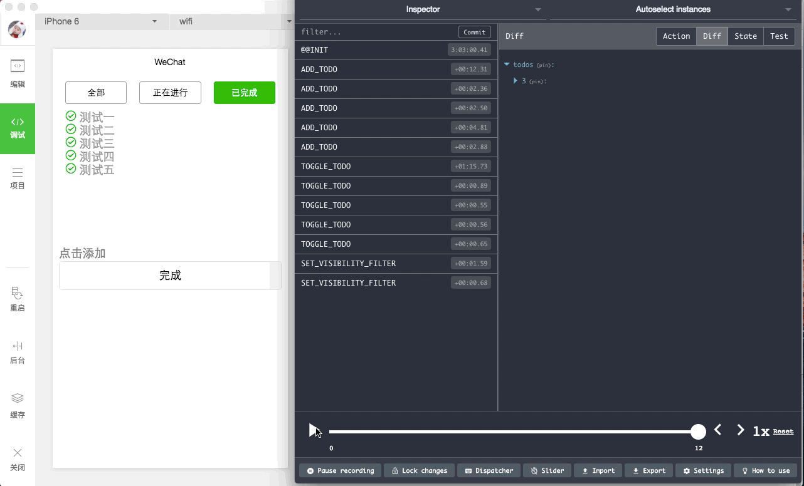
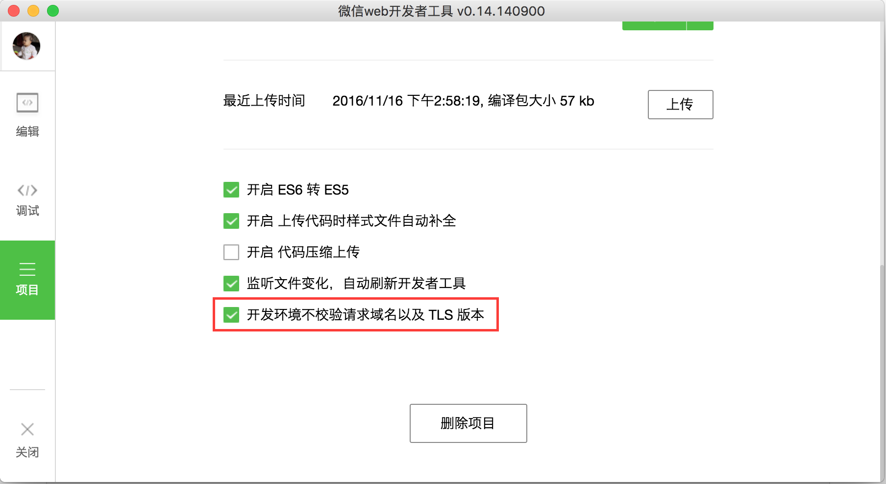

微信小程序集成Redux实现的Todo list
======================
在微信小程序中使用[Redux](https://github.com/reactjs/redux)实现Todo list，同时集成了redux-devtools



需要打开小程序开发工具的配置中`项目`->`基础信息`->`开发环境不校验请求域名以及 TLS 版本 `**



### 使用

导入到微信的开发工具运行就可以了。

### 快速开始

克隆项目文件:

```
git clone git@github.com:pmg1989/wechat-app-redux-todo.git
```

进入`wechat-app-redux-todo`目录安装依赖:

```
npm install 或者 yarn 或者 yarn install
```

开发：

```bash
npm run dev
```

浏览器中访问: [http://localhost:5678](http://localhost:5678), 即可启动redux-devtools调试工具开发调试啦！

### 备注

项目中因为使用了`eslint`检测机制，所以引入了`package.json`等配置文件，在每次 `git commit` 时都会校验代码格式。

### 特别感谢

charleyw: [wechat-weapp-redux](https://github.com/charleyw/wechat-weapp-redux)